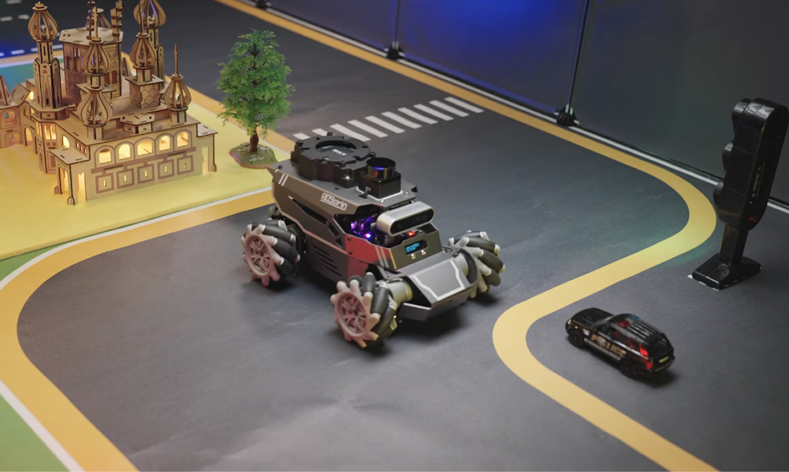
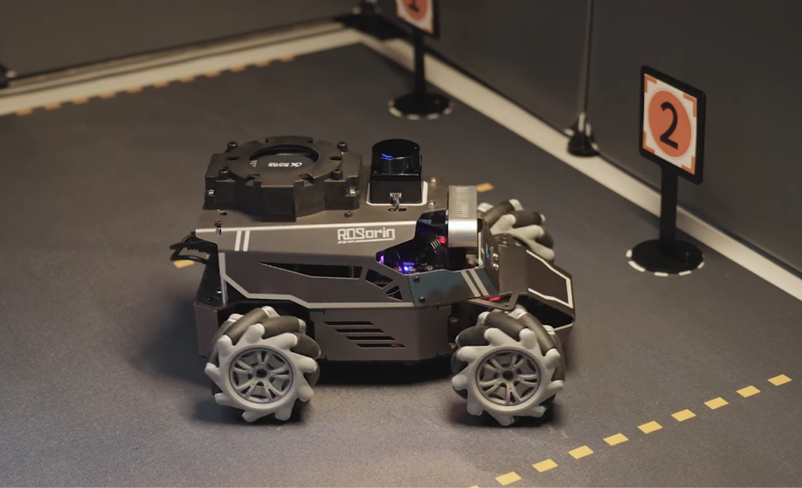
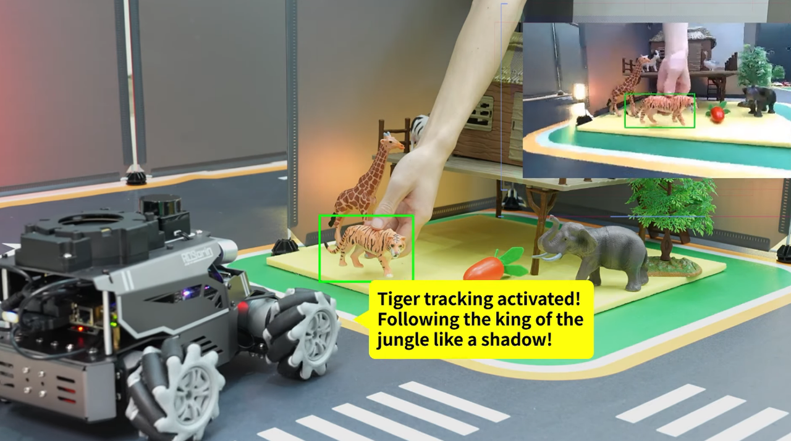
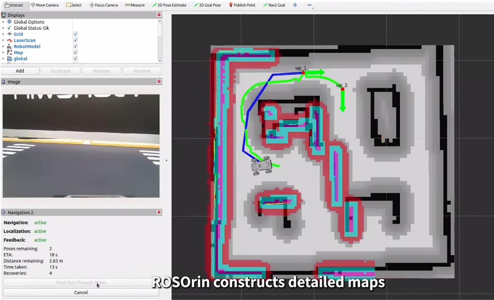

# ROSOrin

[English](https://github.com/Hiwonder/ROSOrin/blob/ROS2/README.md) | 中文

<p align="center">
  
</p>

## 基于ROS2的开源多模态AI机器人

本仓库展示了ROSOrin的演示、示例和开源模块集合。ROSOrin是一款高度集成的ROS2机器人，专为下一代具身AI而打造。它将多模态大模型、实时3D视觉、激光雷达导航和模块化底盘设计融为一体，全部运行在Jetson驱动的系统上。ROSOrin不仅仅是一个机器人套件，更是研究人员、开发者和机器人爱好者探索前沿AI的实验平台。

<p align="center">
  
  
</p>

<p align="center">
  
  
</p>

## 🧠 这款机器人的独特之处

ROSOrin将硬件多功能性与先进AI软件融合在一个统一平台中。它配备激光雷达、3D深度相机和六麦克风阵列，开箱即可实现SLAM导航、3D物体识别和语音交互等任务。除了传统机器人功能外，它还集成了基于OpenAI的多模态AI模型，用于高级任务规划和环境理解。无论您是构建自动驾驶原型、使用YOLOv11和MediaPipe进行视觉实验，还是在麦克纳姆轮、阿克曼和差速底盘之间切换——这款机器人都能适应并随您的项目成长。

## 🚀 全面开源，立即开始构建

本仓库展示了ROSOrin的部分功能，完整源代码、详细教程和AI项目示例随机器人一起提供。如果您想深入ROS2开发、探索多模态AI应用，或创建一个能看、能听、能智能导航的定制机器人，请查看下方官方产品页面开始您的旅程。让我们一起构建机器人的未来！


## 官方资源

### 幻尔科技官方
- **产品页面**: [https://www.hiwonder.com/products/rosorin](https://www.hiwonder.com/products/rosorin)
- **视频**: [https://www.youtube.com/watch?v=b_mb6qqGgI4](https://www.youtube.com/watch?v=b_mb6qqGgI4)
- **教程文档**: [https://docs.hiwonder.com/projects/ROSOrin/en/jetson-orin-nano-version/](https://docs.hiwonder.com/projects/ROSOrin/en/jetson-orin-nano-version/)
- **官方网站**: [https://www.hiwonder.com/](https://www.hiwonder.com/)
- **技术支持**: support@hiwonder.com

### YouTube Shorts
- **厌倦了一个机器人一个底盘？** 😴 来认识ROSOrin！🤖✨ [观看](https://www.youtube.com/shorts/jrIz2km8RhI)
- **激光雷达看到一切！** 🤖不只是测量！📡 [观看](https://www.youtube.com/shorts/wyZXHAtLG7Q)
- **秘密武器？** 👀 大视觉模型！🧠 [观看](https://www.youtube.com/shorts/kxEU1YfewVM)
- **猜猜对机器人比✌️会发生什么？** [观看](https://www.youtube.com/shorts/JHz-59gQs6s)

## 主要功能

### SLAM 和导航
- **Cartographer** - Google Cartographer SLAM
- **SLAM Toolbox** - ROS2 SLAM 解决方案
- **Nav2** - ROS2 导航栈
- **路径规划** - 高级路径规划和避障

### AI 视觉
- **目标检测** - 实时目标识别
- **颜色跟踪** - 基于颜色的目标跟踪
- **人脸检测** - 人脸识别功能
- **手势识别** - 手势控制

### 语音交互
- **离线语音识别** - 讯飞离线语音识别
- **语音命令** - 语音控制机器人
- **语音合成** - 文字转语音

### AI 大模型
- **大语言模型集成** - 大语言模型支持
- **智能对话** - 自然语言交互
- **AI 助手** - 机器人 AI 助手功能

### 多机控制
- **多机协调** - 多机器人协同操作
- **通信** - 机器人间通信

## 硬件配置
- **处理器**: NVIDIA Jetson Orin
- **操作系统**: Ubuntu 22.04 + ROS2 Humble
- **传感器**: 激光雷达、摄像头、IMU
- **通信方式**: WiFi、以太网

## 项目结构

```
src_ros2/
├── command                  # 命令脚本
└── src/
    ├── app/                 # 应用程序包
    ├── bringup/             # 启动配置
    ├── calibration/         # 校准工具
    ├── driver/              # 硬件驱动
    ├── example/             # 示例代码
    ├── interfaces/          # ROS2 接口
    ├── large_models/        # AI 大模型集成
    ├── large_models_examples/ # 大模型示例
    ├── multi/               # 多机控制
    ├── navigation/          # 导航栈
    ├── peripherals/         # 外设驱动
    ├── simulations/         # Gazebo 仿真
    ├── slam/                # SLAM 包
    └── xf_mic_asr_offline/  # 语音识别
```

## 版本信息
- **ROS 版本**: ROS2 Humble
- **Ubuntu 版本**: 22.04 LTS

---

**注意**: 这是 ROS2 分支。如需 ROS1 版本，请切换到 ROS1 分支。
